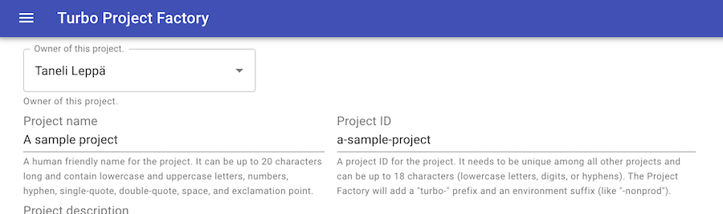

# Project Factory "Turbo"

```
Copyright 2020 Google LLC. This software is provided as-is, without warranty or representation 
for any use or purpose. Your use of it is subject to your agreement with Google.
```



## Installing

You can build a Cloud Run compatible container by building the `[Dockerfile](Dockerfile)`:
```sh
docker build -t eu.gcr.io/<your project id>/turbo-project-factory-frontend:latest .
```

Permissions required for deploying:
- `roles/dns.admin`: DNS administrator (in the project with the DNS zone)
- `roles/oauthconfig.editor`: OAuth Config Editor
- `roles/run.admin`: Cloud Run Admin
- `roles/compute.loadBalancerAdmin`: Compute Load Balancer Admin
- `roles/secretmanager.admin`: Secret Manager Admin
- `roles/iam.serviceAccountAdmin`: Service Account Admin
- `roles/iam.serviceAccountUser`: Service Account User
- `roles/compute.viewer`: Compute Viewer
- `roles/vpcaccess.user`: Serverless VPC Access User in the project where the Serverless connectors are deployed
- `roles/storage.admin`: To add IAM permissions to the charging codes bucket (if used) and to push the container

Command to grant roles:

```sh
export DEPLOYER_ACCOUNT=<your deployer service account>
export PROJECT=<your project id>
export DNS_PROJECT=<your dns project id>

gcloud projects add-iam-policy-binding $DNS_PROJECT -member="serviceAccount:$DEPLOYER_ACCOUNT" --role=roles/dns.admin
for role in roles/oauthconfig.editor roles/run.admin roles/compute.loadBalancerAdmin roles/secretmanager.admin roles/iam.serviceAccountAdmin roles/compute.viewer roles/storage.admin
do
    gcloud projects add-iam-policy-binding $PROJECT --member="serviceAccount:$DEPLOYER_ACCOUNT" --role=$role
done

```

You'll need configuration files from the main Turbo Project Factory to generate the full configuration
template. A helper script called `bundle-configs.py` has been provided:

```sh
python3 bundle-configs.py \
  --app-config appConfig.yaml.tmpl \
  --config ../config.yaml \
  --schema ../projectSchema.yaml \
  --schema-help ../projectSchemaHelp.yaml \
  --approved-apis ../projectApprovedApis.yaml
```

Pass the generated config as a template via the `config_template` variable to Terraform.

*Note*: Please grant a Custom G Suite Role with User and Group read privileges to the service account that the
Cloud Run function is running under. To create the role, go to [admin.google.com](https://admin.google.com) and
select `Admin roles` and `Create new role`. Under *API privileges* select `Users > Read` and `Groups > Read`.

Instructions for doing are here: https://cloud.google.com/identity/docs/how-to/setup#auth-no-dwd
(or use the [grant-groups-administrator.py](../scripts/grant-grouops-administrator.py) script). Instead of
selecting the Groups Administrator `roleId`, select your custom role's ID. 

## Configuration

The configuration is done mostly through Terraform and customizing the `appConfig.yaml.tmpl` file
(CMS content for example). 

### Frontend config

The application is configured via [`appConfig.yaml.tmpl`](appConfig.yaml.tmpl). Most of it configured
automatically based on the Terraform variables, but some may be customized by hand (like CMS content,
ie. what you see on the frontpage).

### Terraform configuration

Create a `terraform.tfvars` file similar to this:

```tf
region = "europe-west1"
project_id = "<YOUR-PROJECT-ID>"
container = "eu.gcr.io/<YOUR-PROJECT-ID>/turbo-project-factory-frontend"
#
# Unfortunately currently there is no way of getting the IAP brand ID through Terraform,
# so you'll have to perform the deployment in two steps. To find the IAP brand, use the
# command: gcloud alpha iap oauth-brands list
iap_brand = "projects/<YOUR-PROJECT-NUM>/brands/<NUMERIC-BRAND-ID>"
#
# If you want a hostname automatically provisioned pointing to the Load Balancer,
# specify the zone here
cloud_dns_zone = "<YOUR-CLOUD-DNS-ZONE>"
#
# The DNS name
dns_name = "project-factory"
#
# Gitlab project where the Turbo Project Factory code is hosted
gitlab_project = "test/project-factory"
# 
# Gitlab URL
gitlab_url = "https://gitlab.example.com/"
#
# Gitlab admin token (please don't put this into tfvars, but instead set it via
# TF_VAR_gitlab_token environment variable)
gitlab_token = "<YOUR-GITLAB-TOKEN>"
#
# The repository URL
repository_url = "ssh://git@gitlab.example.com/test/project-factory.git"
# 
# The deployer service account
deployer_sa = $DEPLOYER_ACCOUNT
#
# Configuration template to use
config_template = "appConfig.yaml.tmpl"
#
# Charging code bucket (if using)
chargingcodes_bucket = "bucket-name"
```

## Gitlab configuration

You'll need to create a Gitlab Project Token if you are using sudo (ie. creating the Merge Requests
under the project requestor's Gitlab account) with `api` and `read_repository` scopes. Copy the project 
access token and create a masked variable called `GITLAB_ACCESS_TOKEN` in Settings > CI/CD > Variables.

Gitlab accounts are mapped by taking the domain off the Identity-Aware Proxy identity (ie. `user@example.com` 
would become `user` Gitlab user ID).

## Backend

Backend is a microservice monolith written in Python 3.7+. 

### Backend API documentation

Full Swagger documentation of the backend API is available when accessing
the API server using `/api/v1` endpoint (eg. `http://localhost:5000/api/v1`).

## Frontend

Frontend is a single-page web application written in React and uses Material UI.
The frontend talks to the backend through endpoints defined in [frontend/public/index.html](frontend/public/index.html).
If you want to replace the backend microservice, you can change the list of endpoints
in the `index.html` file.